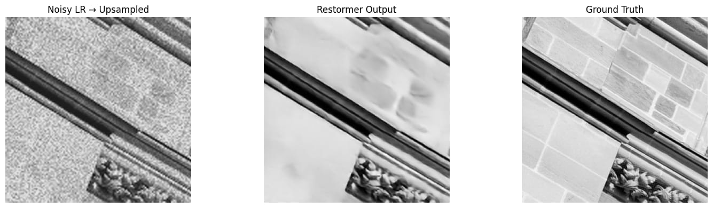
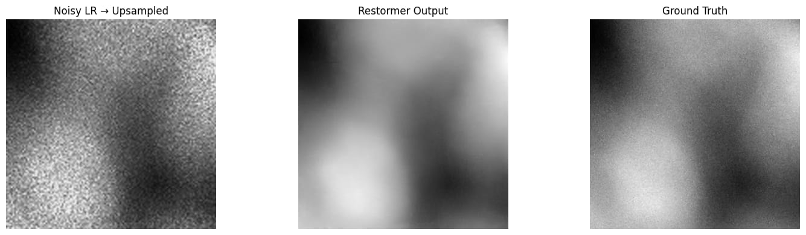

# AI-Based Restoration of Degraded Images for Semiconductor Inspection

This repository contains the offline submission package for the **AI-Based Restoration of Degraded Images** challenge.

The solution uses an efficient **Restormer** architecture fine-tuned to restore degraded/noisy semiconductor inspection images and output clean, high-fidelity restorations.

---

## Results


*Comparison 1: Noisy Image vs Restormer Output vs Ground Truth*


*Comparison 2: Noisy Image vs Restormer Output vs Ground Truth*

---

## Submission Highlights & Key Details

- **Completely Offline**: No internet access is required during evaluation. All network architecture code is bundled locally under `models/Restormer/`.
- **Pre-trained Weights Included**: The trained model weights are packaged at `models/best_restormer.pth`.
- **Input Format**: Directory containing degraded `.npy` files.
- **Output Format**: Directory containing restored `.npy` files matching input filenames.
- **Output Characteristics**:
  - Grayscale 2D numpy array with shape `(256, 256)`
  - Value range strictly normalized to `[0.0, 1.0]`
  - Protected against `NaN` / `Inf` values (`np.nan_to_num` and `np.clip`)

---

## Quick Start & Inference

### 1. Install Dependencies
```bash
pip install -r requirements.txt
```

### 2. Run Inference
Execute the entry point with your input and output directories:

```bash
python run.py <input-dir> <output-dir>
```

#### Example:
```bash
python run.py ./test_inputs ./test_outputs
```

The script will:
1. Scan `<input-dir>` for all `.npy` files.
2. Create `<output-dir>` if it does not exist.
3. Load the model from `models/best_restormer.pth`.
4. Restore each image to `(256, 256)` resolution.
5. Save the output `.npy` to `<output-dir>` preserving the original filename.

---

## Directory Structure

```text
ai-restoration/
│
├── run.py                 # Main offline submission entry point
├── requirements.txt       # Pinned dependencies
├── README.md              # Documentation and execution guide
├── evaluation.py          # Standalone evaluation utility
├── train.py               # Training script to reproduce model
├── best_restormer.pth     # Model weights (root copy)
│
└── models/                # Packaged model and architecture
    ├── __init__.py
    ├── best_restormer.pth # Packaged model weights
    └── Restormer/         # Self-contained Restormer architecture
        ├── __init__.py
        └── restormer_arch.py
```

---

## Training (Optional)

To reproduce the training process from scratch:

```bash
python train.py --noisy_dir path/to/NoisyLR --gt_dir path/to/GT --epochs 10 --batch_size 2
```
